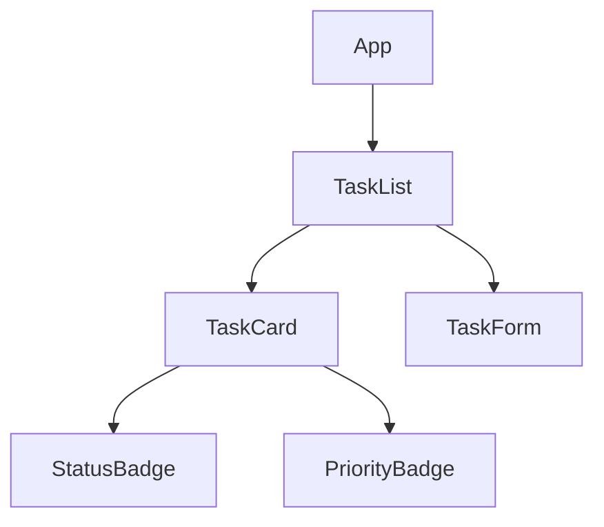

# Automated Codebase Documentation and Architecture Diagrams

## Why This Feature Demonstrates Copilot

- **Documentation Generation**: Auto-generate README, JSDoc
- **Diagram Creation**: Generate architecture diagrams with Mermaid
- **Code Analysis**: Understand and document complex code
- **Markdown Formatting**: Well-structured documentation
- **Multi-File Context**: Understanding project structure

## Problem

Documentation (README.md, ARCHITECTURE.md) requires manual updates. New developers need onboarding docs. Architecture diagrams are outdated.

## Proposed Implementation

### 1. Auto-Generated Architecture Diagrams

```typescript
// scripts/generate-diagrams.ts
- Component hierarchy diagram
- Data flow diagram
- API route diagram
- State management diagram
- File structure visualization
```

### 2. JSDoc Generation

```typescript
// Add comprehensive JSDoc to all functions
- Parameter descriptions
- Return type documentation
- Usage examples
- Related functions
```

### 3. Component Documentation

```typescript
// docs/components/
- Auto-generate prop documentation
- Usage examples
- Visual examples (Storybook-style)
- Accessibility notes
```

### 4. API Endpoint Documentation

```typescript
// docs/api/
- Endpoint descriptions
- Request/response formats
- Error codes
- Rate limits
- Authentication (future)
```

### 5. Onboarding Documentation

```typescript
// docs/ONBOARDING.md
- Getting started guide
- Common tasks
- Architecture walkthrough
- Development workflow
- Troubleshooting guide
```

## Files Affected

- `scripts/generate-docs.ts` - Documentation generator
- `scripts/generate-diagrams.ts` - Mermaid diagram generator
- `docs/components/` - Component documentation
- `docs/api/` - API documentation
- `docs/architecture/` - Architecture docs
- `docs/ONBOARDING.md` - New developer guide
- `docs/CONTRIBUTING.md` - Contribution guidelines
- `docs/TROUBLESHOOTING.md` - Common issues
- All `.ts` and `.tsx` files - Add comprehensive JSDoc
- `.github/workflows/docs.yml` - Auto-publish docs

## Copilot Demo Scenario

### Step 1: Architecture Diagrams (6 minutes)

Create `scripts/generate-diagrams.ts`:

```
Prompt: "Create a script that analyzes the codebase and generates Mermaid diagrams for: component hierarchy, data flow, API routes, and file structure. Output to docs/architecture/"
```

Run and show generated diagrams:



### Step 2: Component Documentation (7 minutes)

Create `scripts/document-components.ts`:

```
Prompt: "Create a script that scans all components, extracts prop types, JSDoc comments, and generates markdown documentation with usage examples"
```

For each component:

```
Prompt: "Generate comprehensive documentation for TaskCard.tsx including: prop table, usage examples, variants, accessibility notes, and related components"
```

### Step 3: JSDoc Auto-Generation (8 minutes)

Open `lib/tasks.ts`:

```
Prompt: "Add comprehensive JSDoc comments to all functions with parameter descriptions, return types, examples, and related functions"
```

Open `app/api/tasks/route.ts`:

```
Prompt: "Add JSDoc to all route handlers with description, request format, response format, error codes, and usage examples"
```

### Step 4: Onboarding Guide (5 minutes)

Create `docs/ONBOARDING.md`:

```
Prompt: "Generate a comprehensive onboarding guide for new developers covering: project setup, architecture overview, common tasks (adding features, debugging), code style, and where to find help"
```

### Step 5: Troubleshooting Guide (4 minutes)

Create `docs/TROUBLESHOOTING.md`:

```
Prompt: "Generate a troubleshooting guide with common issues and solutions covering: build errors, API issues, environment setup, dependency conflicts, and where to get help"
```

### Step 6: Contributing Guidelines (4 minutes)

Create `docs/CONTRIBUTING.md`:

```
Prompt: "Generate contribution guidelines with: code of conduct, development workflow, commit message format, PR process, testing requirements, and code review checklist"
```

### Step 7: Auto-Deploy Docs (4 minutes)

Create `.github/workflows/docs.yml`:

```
Prompt: "Create a GitHub Actions workflow that auto-generates documentation on push to main, deploys to GitHub Pages, and posts documentation URL as comment on PRs"
```

### Step 8: Interactive Component Catalog (bonus, 5 minutes)

Create `app/components-catalog/page.tsx`:

```
Prompt: "Create an interactive component catalog page that displays all components with live examples, prop controls, code snippets, and links to source files"
```

### Live Demo Tips

1. Show generated architecture diagram rendered in GitHub
2. Navigate to component catalog with live examples
3. Show JSDoc appearing in IDE tooltip on hover
4. Demonstrate auto-generated API documentation
5. Walk through onboarding guide as new developer
6. Show troubleshooting guide solving common issue
7. Demonstrate docs auto-deploying on PR merge
8. Show component prop table auto-generated from TypeScript

### Expected Output

- Complete codebase documentation
- Visual architecture diagrams
- Comprehensive JSDoc on all functions
- Interactive component catalog
- New developer onboarding guide
- Troubleshooting documentation
- Auto-deployed documentation site
- CI ensuring docs stay up-to-date
